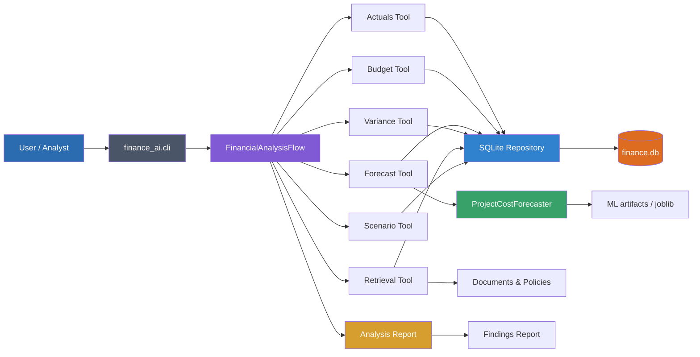
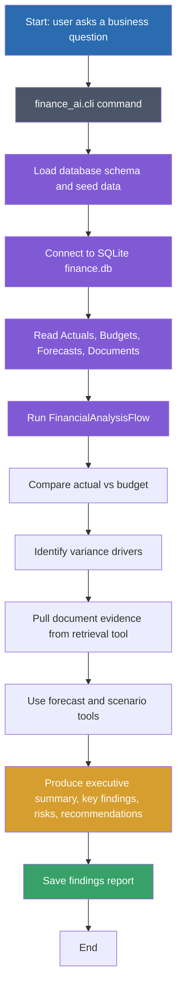

# Project Architecture and Workflow Diagram

## Project Architecture Diagram

## Process Flowchart

## Summary

This project combines a deterministic SQLite financial data layer, a Python CLI, an analysis orchestration flow, supporting financial tools, and a document retrieval/forecasting pipeline. The architecture is designed to produce a report that explains variance, risks, and recommended next investigations.
